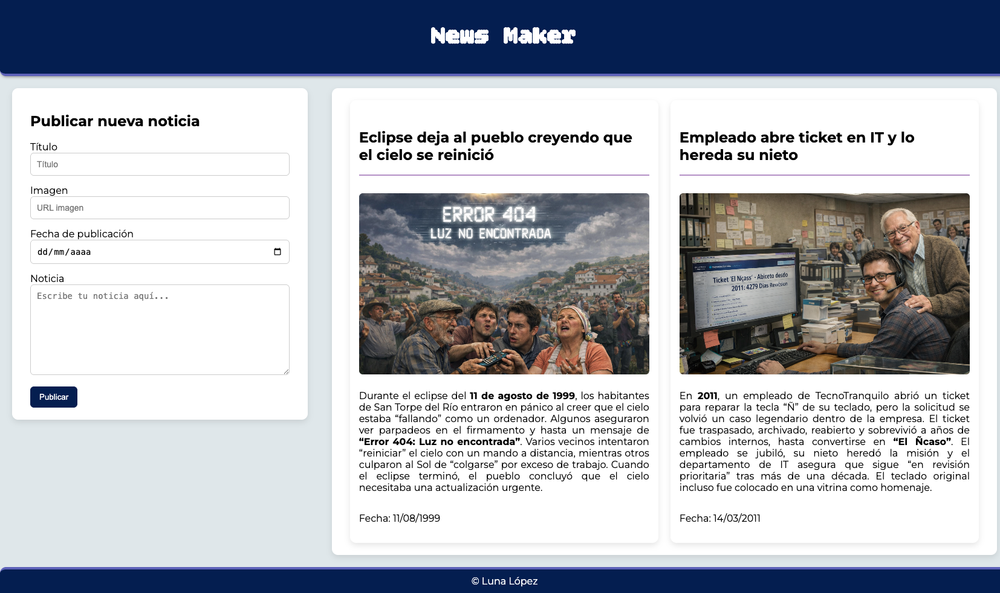
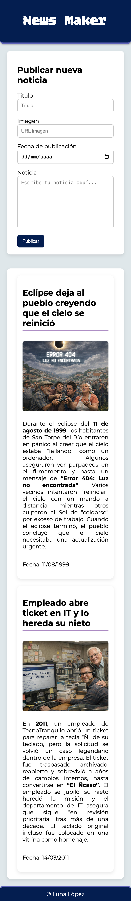

# NewsMaker v2.0 - Sistema de Blogging
Mejoras actividad 5 - Máster Full Stack Developer

## 1. Introducción
Mejoras en el proyecto desarrollado como parte de la Actividad 5 del Máster Full Stack Developer.
La aplicación permite publicar noticias mediante un formulario y visualizar un listado dinámico de publicaciones dentro del mismo componente.

## 2. Objetivos
Crear una mini aplicación tipo blog en Angular que permita:

- Publicar noticias mediante un formulario  
- Validar campos obligatorios  
- Mostrar noticias en un listado dinámico  
- Mantener las noticias ya publicadas  
- Aplicar eventos y templating de Angular  

## 3. Tecnologías y conceptos usados
-Angular
-TypeScript
-HTML5
-CSS3
-Two-way data binding (ngModel)
-Directivas estructurales (@for, @empty)
-Interfaces (INew)
-Manejo de arrays
-Responsive Design
-Servicios de Angular (NewsService)
-SweetAlert2 para alertas visuales

## 4. Estructura del proyecto
```
newsMakerAppv2.0/
├── src/
│   ├── app/
│   │   ├── components/
│   │   │   ├── blog/
│   │   │   │   ├── blog.component.ts
│   │   │   │   ├── blog.component.html
│   │   │   │   └── blog.component.css
│   │   │   ├── form/
│   │   │   │   ├── form.component.ts
│   │   │   │   ├── form.component.html
│   │   │   │   └── form.component.css
│   │   │   └── news-list/
│   │   │       ├── news-list.component.ts
│   │   │       ├── news-list.component.html
│   │   │       └── news-list.component.css
│   │   ├── services/
│   │   │   └── news.service.ts
│   │   ├── interfaces/
│   │   │   └── inew.interface.ts
│   │   ├── db/
│   │   │   └── news.db.ts
│   │   ├── app.ts
│   │   ├── app.html
│   │   └── app.css
│   ├── styles.css
│   └── index.html
└── README.md
```

## 5. Funcionalidades principales  
-Dos noticias iniciales cargadas desde un archivo externo (news.db.ts)
-Formulario con validación obligatoria de todos los campos
-Inserción dinámica en el array de noticias a través del NewsService
-Validación de formato de URL de imagen (opcional)
-Diseño responsive con media queries
-Imágenes siempre centradas y escaladas correctamente (object-fit: cover)
-Alertas visuales con SweetAlert2

## 6. Autora  
Luna López

---

##  Vista previa del proyecto 
>Vista web


>Vista Phone
